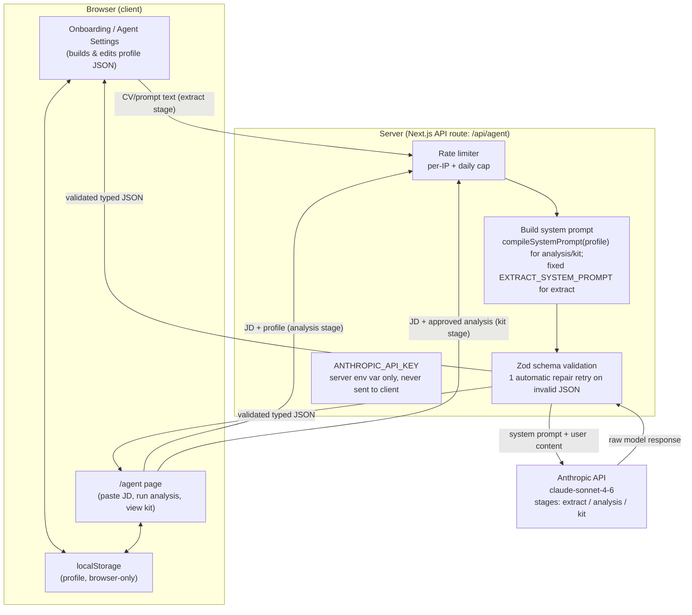

# Architecture — Job Kit Agent

Reference doc for system components and data flow. Written to reflect what's actually built (through the rebrand + human-in-the-loop messaging passes), not aspirational design.

## 1. System overview

## 2. Components

### Client (browser)

| Component | Responsibility |
|---|---|
| Onboarding / Agent Settings | 5-step wizard: basics (fill in manually, or import an existing profile JSON to pre-fill), targets, experience (paste CV or guided prompts), rules, review & compile. Same UI serves first-time setup and later edits — dynamically labeled based on whether a profile already exists. |
| `/agent` page | JD input, track selector, renders fit analysis, gates and renders application kit generation. |
| localStorage | Sole persistence layer in the current architecture. Key: `aka.profile`. Nothing is sent to any server except inside API calls to Anthropic — no accounts, no database (see Phase 3 roadmap for the planned exception). |

### Server

| Component | File | Responsibility |
|---|---|---|
| API route | `app/api/agent/route.ts` | Single entry point for all model calls. Accepts `{stage: "extract" \| "analysis" \| "kit", profile, jd, analysis?}`. |
| Prompt compiler | `lib/compilePrompt.ts` | Pure function: `compileSystemPrompt(profile) -> string`. Deterministic — same profile in, same prompt out. Enforces a token budget (story bank capped at top 8 items). Used for the `analysis` and `kit` stages only — the `extract` stage uses a separate fixed system prompt (`EXTRACT_SYSTEM_PROMPT` in `lib/agentPrompts.ts`) since it has no profile to compile from yet. This is the core IP of the project. |
| Schema layer | `lib/schema.ts` | Zod schemas for Profile and for each stage's output contract (FitAnalysis, ApplicationKit). Single source of truth for validation on both the compiler input side and the model output side. |
| Rate limiter | `lib/rateLimit.ts` | Per-IP request cap + daily total cap, protecting the maintainer's personal Anthropic billing in the absence of per-user auth. Added pre-deployment. |

### External

| Service | Role |
|---|---|
| Anthropic API | `claude-sonnet-4-6`. Called only from the server route, using a server-side environment variable. Three call "stages" share the same route: `extract` (CV/prompt text -> structured story bank), `analysis` (JD + profile -> fit analysis), `kit` (JD + approved analysis -> application kit). |
| Vercel | Hosting + deployment. Auto-deploys from the `main` branch on push. `ANTHROPIC_API_KEY` is set as a Vercel environment variable, never committed to the repo. |

## 3. Data flow — one full cycle

1. User completes onboarding; profile JSON is validated against the schema and saved to `localStorage`.
2. On `/agent`, user pastes a JD and clicks "Run job fit analysis."
3. Client sends `{stage: "analysis", profile, jd}` to `/api/agent`.
4. Server: rate limiter checks the request; if within limits, `compileSystemPrompt(profile)` builds the system prompt; the route calls Anthropic with that system prompt plus the JD.
5. Model returns JSON. Server validates it against the `FitAnalysis` Zod schema. If invalid, one automatic repair retry (re-prompt asking the model to fix its own output to match the schema). If still invalid, a typed error is returned to the client.
6. Client renders the validated fit analysis. **Human checkpoint**: the "Generate application kit" action is disabled until this analysis has rendered.
7. User reviews, then clicks "Generate application kit." Client sends `{stage: "kit", profile, jd, analysis}`.
8. Same compile -> call -> validate cycle runs for the `ApplicationKit` schema; result renders in the kit view with the "AI-drafted from your profile — read it once, make it yours" messaging.

## 4. Key design decisions and why

- **Prompt compiler is a pure, tested function.** Same input always produces the same system prompt — this makes the agent's behavior auditable and testable, not a black box. Snapshot-tested in `lib/compilePrompt.test.ts`.
- **JSON-only output contracts, not free text.** Every model response must validate against a Zod schema before it touches the UI. This is what prevents free-form hallucinated prose from silently reaching the user.
- **Human-in-the-loop is architectural, not just a UI suggestion.** Kit generation is state-gated behind a rendered analysis — this is enforced in the client state logic, not just a styling choice.
- **No database in the current architecture.** Deliberate, not a limitation we forgot to fix — keeps the privacy story simple (nothing leaves the browser except inside model calls) and avoids the security/compliance surface a real user database would introduce. See `docs/PHASE3-ROADMAP.md` for the planned, deliberate expansion into accounts + persistence.
- **One shared API route for all three stages**, rather than three separate routes, keeps the rate-limiting, key-handling, and validation logic in one place rather than triplicated.

## 5. Related docs

- `docs/PRD.md` — full product requirements.
- `docs/BUILD_PLAN.md` — milestone build history and prompts.
- `docs/PHASE2-ROADMAP.md`, `docs/PHASE3-ROADMAP.md` — parked future work (pipeline intelligence; accounts & persistence).
- `docs/PITCH.md` — non-technical pitch version of this same system.
