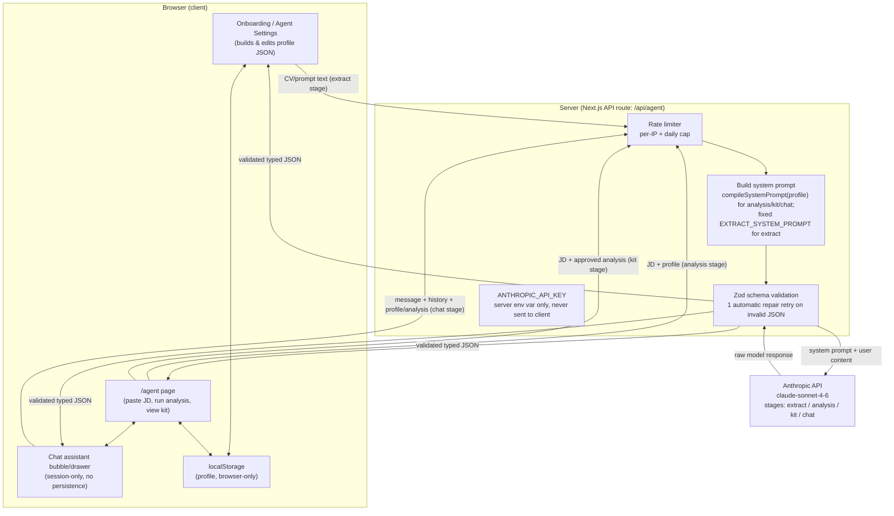

# Architecture — Job Kit Agent

Reference doc for system components and data flow. Written to reflect what's actually built (through the rebrand + human-in-the-loop messaging passes), not aspirational design.

## 1. System overview

```mermaid
flowchart TB
    subgraph Browser["Browser (client)"]
        Onboard["Onboarding / Agent Settings\n(builds & edits profile JSON)"]
        Agent["/agent page\n(paste JD, run analysis, view kit)"]
        Chat["Chat assistant bubble/drawer\n(session-only, no persistence)"]
        Storage["localStorage\n(profile, browser-only)"]
        Onboard <--> Storage
        Agent <--> Storage
        Agent <--> Chat
    end
    subgraph Server["Server (Next.js API route: /api/agent)"]
        Compile["Build system prompt\ncompileSystemPrompt(profile) for analysis/kit/chat;\nfixed EXTRACT_SYSTEM_PROMPT for extract"]
        Validate["Zod schema validation\n1 automatic repair retry on invalid JSON"]
        RateLimit["Rate limiter\nper-IP + daily cap"]
        Key["ANTHROPIC_API_KEY\nserver env var only, never sent to client"]
    end
    Anthropic["Anthropic API\nclaude-sonnet-4-6\nstages: extract / analysis / kit / chat"]
    Onboard -- "CV/prompt text (extract stage)" --> RateLimit
    Agent -- "JD + profile (analysis stage)" --> RateLimit
    Agent -- "JD + approved analysis (kit stage)" --> RateLimit
    Chat -- "message + history + profile/analysis (chat stage)" --> RateLimit
    RateLimit --> Compile
    Compile --> Validate
    Validate -- "system prompt + user content" --> Anthropic
    Anthropic -- "raw model response" --> Validate
    Validate -- "validated typed JSON" --> Agent
    Validate -- "validated typed JSON" --> Onboard
    Validate -- "validated typed JSON" --> Chat
```

## 2. Components

### Client (browser)

| Component | Responsibility |
|---|---|
| Onboarding / Agent Settings | 5-step wizard: basics (fill in manually, or import an existing profile JSON to pre-fill), targets, experience (paste CV or guided prompts), rules, review & compile. Same UI serves first-time setup and later edits — dynamically labeled based on whether a profile already exists. |
| `/agent` page | JD input, track selector, renders fit analysis, gates and renders application kit generation. |
| Chat assistant (`components/ChatAssistant.tsx`) | Floating bubble on `/agent` (bottom-right, collapsed by default) that expands into an overlay drawer — not a modal, doesn't block the page underneath. Read-only and advisory only: discusses the current profile/analysis, cannot trigger analysis or kit generation, cannot edit the profile. Conversation is component state only — cleared on refresh, nothing persisted. |
| localStorage | Sole persistence layer in the current architecture. Key: `aka.profile`. Nothing is sent to any server except inside API calls to Anthropic — no accounts, no database (see Phase 4 roadmap for the planned exception). |

### Server

| Component | File | Responsibility |
|---|---|---|
| API route | `app/api/agent/route.ts` | Single entry point for all model calls. Accepts `{stage: "extract" \| "analysis" \| "kit" \| "chat", profile, jd, analysis?}` (the `chat` stage instead takes `{profile, analysis?, message, history?}`). |
| Prompt compiler | `lib/compilePrompt.ts` | Pure function: `compileSystemPrompt(profile) -> string`. Deterministic — same profile in, same prompt out. Enforces a token budget (story bank capped at top 8 items). Used for the `analysis`, `kit`, and `chat` stages — the `chat` stage wraps its output with hard-boundary instructions (`buildChatSystemPrompt()` in `lib/agentPrompts.ts`). The `extract` stage uses a separate fixed system prompt (`EXTRACT_SYSTEM_PROMPT`) instead, since it has no profile to compile from yet. `compileSystemPrompt()` is the core IP of the project. |
| Schema layer | `lib/schema.ts` | Zod schemas for Profile and for each stage's output contract (FitAnalysis, ApplicationKit). Single source of truth for validation on both the compiler input side and the model output side. |
| Rate limiter | `lib/rateLimit.ts` | Per-IP request cap + daily total cap, protecting the maintainer's personal Anthropic billing in the absence of per-user auth. Added pre-deployment. |

### External

| Service | Role |
|---|---|
| Anthropic API | `claude-sonnet-4-6`. Called only from the server route, using a server-side environment variable. Four call "stages" share the same route: `extract` (CV/prompt text -> structured story bank), `analysis` (JD + profile -> fit analysis), `kit` (JD + approved analysis -> application kit), `chat` (message + optional history/analysis -> a single advisory reply, `{message: string}`). |
| Vercel | Hosting + deployment. Auto-deploys from the `main` branch on push. `ANTHROPIC_API_KEY` is set as a Vercel environment variable, never committed to the repo. |

## 3. Data flow — one full cycle

1. User completes onboarding; profile JSON is validated against the schema and saved to `localStorage`.
2. On `/agent`, user pastes a JD and clicks "Run job fit analysis."
3. Client sends `{stage: "analysis", profile, jd}` to `/api/agent`.
4. Server: rate limiter checks the request; if within limits, `compileSystemPrompt(profile)` builds the system prompt; the route calls Anthropic with that system prompt plus the JD.
5. Model returns JSON. Server validates it against the `FitAnalysis` Zod schema. If invalid, one automatic repair retry (re-prompt asking the model to fix its own output to match the schema). If still invalid, a typed error is returned to the client.
6. Client renders the validated fit analysis. **Human checkpoint**: the "Generate application kit" action is disabled until this analysis has rendered.
7. User reviews, then clicks "Generate application kit." Client sends `{stage: "kit", profile, jd, analysis}`.
8. Same compile -> call -> validate cycle runs for the `ApplicationKit` schema; result renders in the kit view with the "AI-drafted from your profile — read it once, make it yours" messaging.

**Chat, independently of the above cycle**: at any point on `/agent`, the user can open the chat drawer and ask a question. Client sends `{stage: "chat", profile, analysis?, message, history?}` — `analysis` is included if one has been run this session, `history` is the prior turns of the conversation so far (component state only). Server runs the same compile -> call -> validate cycle against a `{message: string}` schema, with the system prompt wrapped in hard-boundary instructions (never claims to trigger analysis/kit/profile edits; redirects honestly to the real UI control instead). Nothing here is persisted — a page refresh clears the conversation.

## 4. Key design decisions and why

- **Prompt compiler is a pure, tested function.** Same input always produces the same system prompt — this makes the agent's behavior auditable and testable, not a black box. Snapshot-tested in `lib/compilePrompt.test.ts`.
- **JSON-only output contracts, not free text.** Every model response must validate against a Zod schema before it touches the UI. This is what prevents free-form hallucinated prose from silently reaching the user.
- **Human-in-the-loop is architectural, not just a UI suggestion.** Kit generation is state-gated behind a rendered analysis — this is enforced in the client state logic, not just a styling choice.
- **No database in the current architecture.** Deliberate, not a limitation we forgot to fix — keeps the privacy story simple (nothing leaves the browser except inside model calls) and avoids the security/compliance surface a real user database would introduce. See `docs/PHASE4-ROADMAP.md` for the planned, deliberate expansion into accounts + persistence.
- **One shared API route for all four stages**, rather than separate routes, keeps the rate-limiting, key-handling, and validation logic in one place rather than duplicated — the chat stage's rate limiting is free as a result, since the same `rateLimiter.check()` call already runs before any stage dispatches.
- **The chat assistant is read-only and non-authoritative by design**, not a general "agent does everything via chat" redesign — see `docs/PHASE2-ROADMAP.md` section 3. It can discuss the profile and current analysis but has no ability to trigger kit generation, run a new analysis, or write to the profile; this is enforced by what the client ever sends it (no write path exists) and reinforced in the system prompt so it redirects honestly instead of claiming capabilities it doesn't have. Preserves the same human-in-the-loop property described above rather than working around it.

## 5. Related docs

- `docs/PRD.md` — full product requirements.
- `docs/BUILD_PLAN.md` — milestone build history and prompts.
- `docs/PHASE2-ROADMAP.md` — the chat assistant's original design doc (now built; see sections 1-4 above). `docs/PHASE3-ROADMAP.md`, `docs/PHASE4-ROADMAP.md` — still-parked future work (pipeline intelligence; accounts & persistence).
- `docs/PITCH.md` — non-technical pitch version of this same system.
